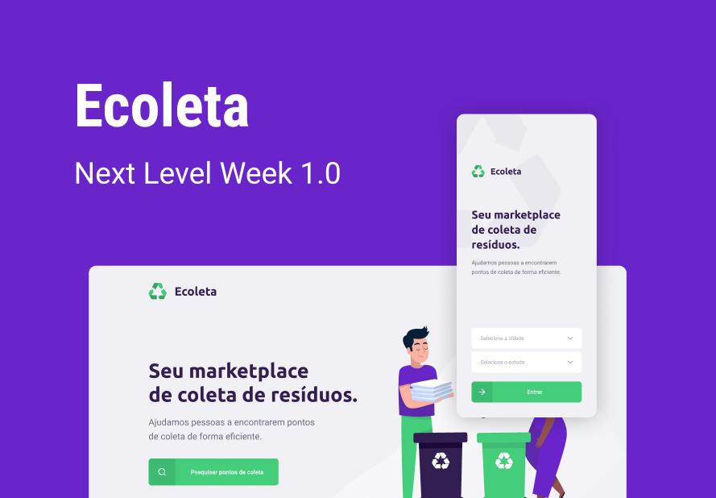
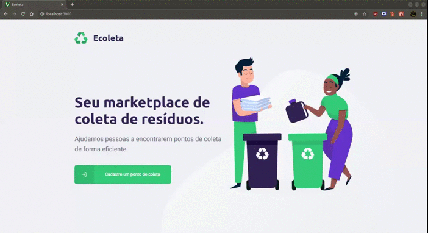

  <h1 align="center">♻️ Next Level Week #1 - Projeto Ecoleta ♻️</h1>

  <p align="center">
  <a href="https://github.com/hpbonfim/NLW#readme">
    
  </a>

  <a href="https://github.com/hpbonfim/NLW#readme">
    
  </a>

  <a href="https://github.com/hpbonfim/NLW#readme">
    
  </a>

  <a href="https://github.com/hpbonfim/NLW/commits/master">
    
  </a>

  <a href="https://github.com/hpbonfim/NLW#readme">
    
  </a>

  <a href="https://github.com/hpbonfim/NLW/graphs/commit-activity">
    
  </a>
  </p>
  <p align="center">
    <a href="https://insomnia.rest/run/?label=&uri=https://github.com/hpbonfim/NLW/backend/Ecoleta_collection.json" target="_blank">
    
    </a>
  </p>

<p align="center">
  <a  href="https://www.figma.com/file/tC1YvNt3rCLRL0irWTS33v/Ecoleta-Booster-Copy?node-id=0%3A1">
    
  </a>
</p>
    <h3 align="center">Ecoleta é uma aplicação para registro e encontro de pontos de coleta de resíduos recicláveis como pilhas, baterias, lâmpadas, entre outros . </h3>
<p align="center">
  <a href="https://www.figma.com/file/tC1YvNt3rCLRL0irWTS33v/Ecoleta-Booster-Copy?node-id=0%3A1">
    
  </a>
</p>


|Tecnologias utilizadas  |
|---------|
|[TypeScript](https://www.typescriptlang.org/)     |
|[React](https://pt-br.reactjs.org/)     |
|[React Native](https://reactnative.dev/)   |
|[Node v12.17.0](https://nodejs.org/en/)     |
|[npm  6.14.4](https://www.npmjs.com/)    |


### Iniciar o Backend

``` 
$ npm install
$ npm run dev 
```

### Iniciar o Frontend

``` 
$ npm install
$ npm start
```


### Iniciar o Mobile

``` 
$ npm install
$ expo start
```
- Para o app mobile funcionar corretamente altere a [baseURL](frontend/mobile/src/services/api.ts) para compartilhar a mesma comunicação com o [backend](backend/src/config/host.ts).


### Endpoints API

- **POST**: `/points` - Cadastro de pontos de coleta ( Type: Multipart/FormData )
- **GET**: `/points` - Listagem dos pontos para ( Type: JSON )
- **GET**: `/points/:id` - Mostrar um ponto de coleta específico ( Type: JSON )
- **GET**: `/items` - Listagem dos items para coleta ( Type: JSON )

### API externas utilizadas
[Nominatim - reverse search map address](https://nominatim.org/release-docs/develop/api/Reverse/)

[Nominatim - Search map address](https://nominatim.org/release-docs/develop/api/Search/)

[IBGE - Dados diversos](https://servicodados.ibge.gov.br/api/docs/localidades?versao=1#api-_)

[ViaCep - Consulta de CEP's](https://viacep.com.br/)

<p align="center">Sinceros agradecimentos a equipe <a href="https://rocketseat.com.br/" >Rocketseat</a> por compartilhar e disseminar o conhecimento! </p>

<p align="center">Made with ❤️ by <a href="https://github.com/hpbonfim" >Henrique Bonfim</a>
